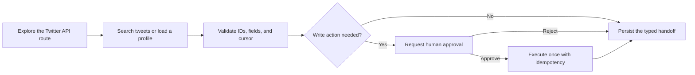

import LlmsDirective from "/snippets/llms-directive.mdx";

<LlmsDirective />

Build a LangChain Twitter API agent through Xquik's MCP server. Search tweets,
inspect profiles, export followers, replay monitor events, and review X actions.
This LangChain Twitter API integration helps when building agents for Twitter.
It preserves tweet IDs, timestamps, cursors, and route errors as typed values.

## Why use LangChain with a Twitter API?

LangChain connects Xquik tools to models, retrievers, databases, and application
services. LangGraph adds durable state, resumable jobs, and human approval.

Choose a narrow route for each Twitter agent task.

| Agent task            | Xquik route                   | Preserve for the next step                        |
| --------------------- | ----------------------------- | ------------------------------------------------- |
| Search tweets         | `GET /api/v1/x/tweets/search` | Query, tweet IDs, authors, `created`, and cursor  |
| Inspect a profile     | `GET /api/v1/x/users/{id}`    | User ID, username, biography, and follower count  |
| Export followers      | `POST /api/v1/extractions`    | Extraction ID, status, poll URL, and export state |
| Watch keywords        | `POST /api/v1/monitors`       | Monitor ID, event types, and next billing time    |
| Replay monitor events | `GET /api/v1/events`          | Event IDs, `has_more`, and `next_cursor`          |
| Post or reply         | The matching X write route    | Tweet ID, action ID, status, and charged credits  |

Use LangChain for short tool-calling conversations. Use LangGraph when work must
resume after failures, approvals, or process restarts. Both use the same MCP
tools and normalized response contract.

## LangChain Twitter API prerequisites

- Python 3.10 or later
- An [Xquik API key](/x-api-quickstart) beginning with `xq_`
- A LangChain-supported model with tool and structured-output support
- A connected X account for private reads or write actions

Public X reads do not require X Developer credentials. Authenticate with Xquik.
Connect an X account only when the selected route requires it.
This supplies a Twitter API for Python agents through one MCP connection.

Authenticate this MCP server with an Xquik API key.
Do not send OAuth 2.0 or an OAuth token.
Keep credentials outside user context, prompts, and agent memory.

## Install the Python packages

Install compatible minor ranges. This avoids silent breaking changes.

```bash
python -m pip install --upgrade \
  "langchain>=1.3,<1.4" \
  "langchain-mcp-adapters>=0.3,<0.4" \
  langchain-anthropic \
  python-dotenv
```

Model Context Protocol (MCP) powers LangChain MCP support.
LangChain MCP support comes from `langchain-mcp-adapters`.
This open-source adapter loads tool schemas from configured MCP server connections.
MCP clients turn model tool calls into authenticated HTTP requests.

### Separate MCP clients, servers, and model credentials

LangChain runs the MCP client. Xquik runs the MCP server. The client loads tool
definitions before the first API call. The server validates each route, HTTP
method, query, body, and Xquik API key.

Use an OpenAI API key only with a compatible model provider.
Keep every model credential separate from the Xquik key. Never send either
credential through prompts, user context, tool arguments, or saved handoffs.

Store secrets outside source control.

```bash .env
XQUIK_API_KEY=xq_YOUR_KEY_HERE
ANTHROPIC_API_KEY=sk-ant-...
```

Add `.env` and generated handoff files to `.gitignore`.

```text .gitignore
.env
xquik-*-handoff.json
```

## How to use the Twitter API in Python with LangChain

Use Pydantic for the final handoff. Do not rename a text response to `.json`.
Validated output rejects missing tweet IDs and malformed cursors.

```python
import asyncio
import os
from pathlib import Path
from typing import Literal

from dotenv import load_dotenv
from langchain.agents import create_agent
from langchain_mcp_adapters.client import MultiServerMCPClient
from pydantic import BaseModel


class TweetRow(BaseModel):
    tweet_id: str
    text: str
    author_username: str | None = None
    created: int | None = None
    url: str | None = None


class TweetSearchHandoff(BaseModel):
    query: str
    route_used: str
    tweets: list[TweetRow]
    has_more: bool
    next_cursor: str | None = None
    stop_reason: Literal[
        "complete",
        "requested_limit",
        "cursor_stalled",
        "page_cap",
    ]


async def main() -> None:
    load_dotenv()

    client = MultiServerMCPClient(
        {
            "xquik": {
                "transport": "http",
                "url": "https://xquik.com/mcp",
                "headers": {"x-api-key": os.environ["XQUIK_API_KEY"]},
            },
        }
    )
    tools = await client.get_tools()

    agent = create_agent(
        model="anthropic:claude-sonnet-4-6",
        tools=tools,
        response_format=TweetSearchHandoff,
        system_prompt=(
            "Use Xquik for Twitter API requests. Preserve exact IDs and cursors. "
            "Use GET /api/v1/x/tweets/search. Never invent missing tweet fields."
        ),
    )

    result = await agent.ainvoke(
        {
            "messages": [
                {
                    "role": "user",
                    "content": (
                        "Search 25 recent tweets about LangChain MCP. "
                        "Return the query, route, tweet rows, cursor state, "
                        "and an explicit stop reason."
                    ),
                }
            ]
        }
    )
    handoff = result["structured_response"]
    Path("xquik-langchain-handoff.json").write_text(
        handoff.model_dump_json(indent=2),
        encoding="utf-8",
    )


asyncio.run(main())
```

Wait for `result = await`, then read `structured_response`.

`MultiServerMCPClient` loads the `docs`, `search`, and `execute` tools. The client is
stateless by default. Save every cursor, job ID, and write status externally.

The `execute` tool executes a bounded sandbox function. That function calls
`xquik.request(path, { method, body, query })`. The sandbox injects authentication.
Use `search` first when the agent does not know a route or parameter.
Each call uses the documented Xquik route and response fields.

## Preserve the MCP response contract

MCP returns normalized snake_case fields and Unix-second timestamps. A REST
`createdAt` field becomes `created`, not `created_at`. Preserve source values
before applying an application-specific schema.

Search and list responses use `has_more` and `next_cursor`. Reuse the same
query and filters on every page. Pass `next_cursor` as `cursor` for tweets,
profiles, followers, replies, timelines, communities, and lists.

Events, draws, and extraction pages use `cursor`. Radar pages use `after`.
Draft pages use `afterCursor`. Treat each cursor as opaque.

Stop pagination when one condition becomes true:

- The agent collects the requested total.
- `has_more` becomes `false`.
- `next_cursor` is missing.
- `next_cursor` repeats.
- The agent reaches the configured page cap.

An empty page can still have `has_more: true`. Continue when the cursor
advances. De-duplicate tweets and users by their stable `id` values.

MCP tool output has a 24,000-character limit. Project only the required fields.
Choose extraction exports for complete-row workflows.

## Keep a resumable Twitter agent handoff

Conversation history is not a reliable job database. Persist the values needed
for retries, pagination, exports, and downstream tools.

<CardGroup cols={2}>

  <Card title="Tweet search rows" icon="search">

    Store `tweet_id`, `text`, `author_username`, `created`, `url`, `has_more`,
    `next_cursor`, and the original query.

  </Card>
  <Card title="User profile rows" icon="users">

    Store source `id` as `user_id`. Keep `username`, `name`, `description`,
    `followers`, `verified`, and `profile_picture`.

  </Card>
  <Card title="Follower exports" icon="download">

    Store the source user, extraction ID, status, poll URL, export state, and
    requested file format.

  </Card>
  <Card title="Tweet replies" icon="message-circle">

    Store the root tweet ID, reply IDs, parent IDs, cursor state, and coverage
    diagnostics. Keep nested replies separate.

  </Card>
  <Card title="Monitor events" icon="radio">

    Store `monitor_id`, `event_id`, `type`, `occurred_at`, `has_more`, and
    `next_cursor`. Use the next cursor as `cursor`.

  </Card>
  <Card title="Webhook delivery" icon="webhook">

    Store `webhook_id`, `delivery_id`, and `stream_event_id`. Keep the one-time
    webhook secret in a secret manager.

  </Card>
  <Card title="Write actions" icon="send">

    Store `tweet_id` or `write_action_id`. Keep `status`, `charged_credits`,
    `poll`, and the idempotency key.

  </Card>
  <Card title="Media attachments" icon="image">

    Pass public image or video URLs in `media` for tweets. Use uploaded
    `media_id` values only for direct messages.

  </Card>
</CardGroup>

Keep API keys, webhook secrets, headers, and raw signatures outside agent state.
Do not place private messages or full request bodies in shared traces.

## Build Twitter API error handling

Do not let the model guess whether a failed request should retry.
Match every HTTP status code before choosing the next action.
A 400 Bad Request indicates invalid route parameters or unsupported fields.

| Status | Meaning                                           | LangChain agent decision                            |
| ------ | ------------------------------------------------- | --------------------------------------------------- |
| `400`  | Invalid route parameters or unsupported fields    | Fix the request before retrying                     |
| `401`  | Missing or invalid authentication                 | Stop and replace the Xquik credential               |
| `402`  | Subscription or credit action required            | Report choices and request explicit confirmation    |
| `424`  | Upstream dependency failure or incomplete replies | Preserve partial rows and inspect `error.retryable` |
| `429`  | Rate limit reached                                | Respect `error.retry_after`, then back off          |
| `502`  | Temporary upstream failure                        | Apply bounded backoff to safe read retries          |

Errors contain `error.type`, `error.code`, and `error.message`. Some errors add
`error.retryable` or `error.retry_after`. Store these fields with the job.

Preserve exact error messages for operators. Record where the error occurred.
Server errors may permit bounded retries for safe reads. Client errors require
a corrected request or credential. Test edge cases such as repeated cursors,
expired keys, empty pages, and partial reply trees.

A `402` never authorizes a purchase. Report available payment choices. Wait
for an explicit decision before any supported account checkout action.

## Add human approval to X actions

Read-only agents can search tweets and inspect public profiles automatically.
Write-enabled agents need a review boundary before posting or replying.

Xquik exposes reads and writes through one aggregate `execute` tool. Therefore,
interrupt every `execute` call in a write-capable agent. Review the proposed call
before approving it.

```python
from langchain.agents import create_agent
from langchain.agents.middleware import HumanInTheLoopMiddleware
from langgraph.checkpoint.memory import InMemorySaver

agent = create_agent(
    model="anthropic:claude-sonnet-4-6",
    tools=tools,
    middleware=[
        HumanInTheLoopMiddleware(
            interrupt_on={
                "xquik": {
                    "allowed_decisions": ["approve", "reject"],
                }
            }
        )
    ],
    checkpointer=InMemorySaver(),
)

config = {
    "configurable": {
        "thread_id": "xquik-twitter-agent-job-001",
    }
}

pending = await agent.ainvoke(
    {
        "messages": [
            {
                "role": "user",
                "content": "Draft a reply, but never post without my approval.",
            }
        ]
    },
    config=config,
)
```

`InMemorySaver` suits local development only. Use a persistent LangGraph
checkpointer in production. Resume with the same `thread_id` after approval.
Reject any action with an unexpected route, account, target, text, or media.

## Build durable LangGraph Twitter workflows

A LangGraph Twitter agent should separate discovery, review, execution, and
storage. Separating these stages prevents duplicate charged actions during
recovery.



Persist the graph after each external call. Store the last completed node,
route, request fingerprint, response IDs, cursor, and retry count. Store write
idempotency keys before execution.

Never retry a pending write by creating a new action. Poll its returned status.
Apply bounded backoff to safe reads only when the contract permits it.

## Connect multiple MCP servers

A LangChain MCP server entry defines its transport, URL, and headers. Name each
server uniquely. This keeps multiple MCP servers distinct inside the agent.

Prefix tool names when another MCP server exposes similar operations. This
prevents the model from choosing the wrong search or publishing tool.

```python
client = MultiServerMCPClient(
    {
        "xquik": {
            "transport": "http",
            "url": "https://xquik.com/mcp",
            "headers": {"x-api-key": os.environ["XQUIK_API_KEY"]},
        },
        "knowledge": {
            "transport": "http",
            "url": "https://knowledge.example.com/mcp",
        },
    },
    tool_name_prefix=True,
)
```

Give the Xquik agent only the tools required for its current job. Smaller tool
sets improve route selection and reduce accidental actions.

## Tested LangChain compatibility

Xquik checked these versions on August 2, 2026.

| Package                  | Checked version | Supported range in this guide           |
| ------------------------ | --------------- | --------------------------------------- |
| Python                   | 3.10 or later   | `>=3.10`                                |
| `langchain-mcp-adapters` | 0.3.0           | `>=0.3,<0.4`                            |
| `langchain`              | 1.3.14          | `>=1.3,<1.4`                            |
| `langgraph`              | 1.2.10          | Installed through LangChain constraints |

Pin exact versions in production lockfiles. Re-test structured output, approval,
and checkpointer behavior before upgrading a minor range.

## LangChain Twitter API questions

### Can LangChain call the Twitter API?

Yes. Load Xquik through `langchain-mcp-adapters`. The agent can call eligible
tweet, profile, follower, monitor, extraction, and X action routes.

### Can LangChain scrape tweets with Python?

Yes. Call `GET /api/v1/x/tweets/search` through MCP. Preserve each tweet ID,
text, author, `created` timestamp, URL, and pagination cursor.

### What does "Python API Twitter" mean?

"Python API Twitter" reverses the usual Python Twitter API search phrase.
Python runs LangChain, and LangChain calls Xquik through MCP. The agent can
search tweets, inspect profiles, export followers, and review X actions.

### What does LangChain MCP add to a Twitter agent?

LangChain MCP converts remote operations into model-callable tools. Xquik adds
tweet search, profile lookup, follower exports, monitors, and reviewed actions.

### Can LangChain post tweets through MCP?

Yes. Connect the target X account first. Require human approval, preserve the
idempotency key, and store the returned tweet or write-action ID.

### How do I authenticate with the Twitter API using Python?

Send an Xquik API key in the MCP `x-api-key` header. X Developer keys are not
required. Some private reads and writes require a connected Twitter account.

### Should I use LangChain or LangGraph for tweet search?

Use LangChain for a short search and typed handoff. Use LangGraph for paginated
searches, approvals, checkpoints, durable retries, or scheduled monitoring.

### How does a LangChain agent paginate Twitter results?

Save `has_more` and `next_cursor`. Send the cursor with unchanged filters.
Stop on completion, limits, or a stalled cursor.

### How do I prevent an agent from posting automatically?

Interrupt every `execute` tool call in write-capable agents. Approve the exact
route, account, target, text, and media before execution.

### How do I post a tweet using Python with LangChain?

Ask the agent to use the matching X write route. Review the exact text,
account, media, and idempotency key. Approve the tool call once.

### How do I handle Twitter API rate limits in Python?

Read `error.retry_after` from `429` responses. Wait for that interval. Retry
safe read requests with bounded backoff. Never recreate a pending write.

### How should a Python Twitter API agent save results?

Validate a Pydantic schema first. Persist typed tweet IDs, fields, cursors,
errors, and job status. Never save conversational prose as JSON.

### Can a LangGraph agent export Twitter followers?

Yes. Create an extraction, persist its ID, and poll its status. Export only
after completion. Store the source user and requested format together.

### Can LangChain monitor Twitter keywords continuously?

Yes. Create a monitor and webhook, then store their IDs. Replay missed events
through `GET /api/v1/events` using `cursor` pagination.
Monitor events are asynchronous. They are not guaranteed real time.

## Next steps

- Review the [MCP tool contract](/mcp/tools).
- Follow the [agent handoff checklist](/mcp/agent-handoff).
- Build a [tweet search workflow](/guides/tweet-scraper-csv-export).
- Add [monitor and webhook delivery](/guides/brand-monitoring-workflow).
- Compare [Twitter API alternatives](/twitter-api-alternatives).

Xquik is an independent third-party service. Not affiliated with X Corp.
"Twitter" and "X" are trademarks of X Corp.
